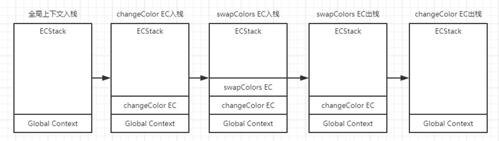
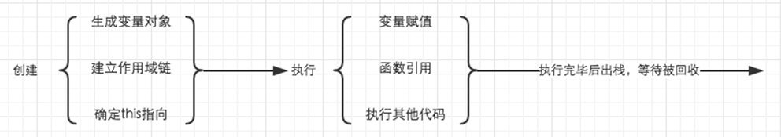
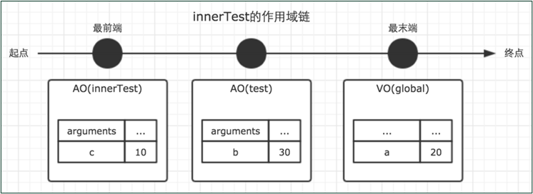
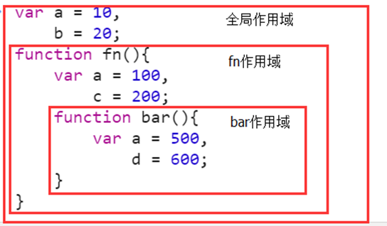

# 函数的定义和调用过程

#### （1）  执行上下文

##### 1. JavaScript“编译型”语言

JavaScript 是一种具有函数优先的轻量级，**解释型或即时编译型**的编程语言

编译型语言写的程序执行之前，需要一个专门的编译过程，把所有程序编译成为机器语言的文件

解释型语言**在运行程序的时候才编译**，每执行**一段**代码就要翻译**一段**代码

两种方式只是编译的时机不同

##### 2. JavaScript代码执行过程

JavaScript 引擎是**一段一段**地运行代码的（作用域范围，全局是一段，函数是一段）

JavaScript 代码执行时，会为当前代码创建相应的运行环境

##### 3. JavaScript运行环境

全局环境：代码运行起来后会进入全局环境

函数环境：当函数被调用执行时，会进入当前函数中执行代码

eval 环境：不建议使用，不做介绍

#####  4. 执行上下文

可以理解为当前代码的**运行环境（执行上下文）**

作用是用来保存当前代码运行时所需要的数据

在全局环境、函数环境中会创建执行上下文

##### 5. 执行上下文栈

执行上下文栈按照函数的调用顺序来管理执行上下文

栈底永远是全局上下文，栈顶是当前正在执行的函数

特点：先进后出

```javascript
var color = 'blue';
function changeColor(){
    var anotherColor = 'red';
    function swapColors(){
        var tempColor = anotherColor;
        anotherColor = color;
        color = tempColor;
    }
    swapColors();
}
changeColor();
```



Global Context在关闭浏览器\退出程序时出栈\销毁

**函数*执行时*才会创建执行上下文，当一个函数调用时，一个新的执行上下文（就是一个对象）就会被创建**

##### 6. 生命周期

当一个函数调用时，一个新的**执行上下文**就会被创建

执行上下文的生命周期：创建阶段、执行阶段、等待回收阶段

每个执行上下文都有一个与之关联的**变量对象**（variable object）和一个**作用域链**（scope chain）



```javascript
testEC = {
	VO:{},          //变量对象
	scopeChain:[],  //作用域链
	this:{}         //this指向
}
```

##### 7. return语句作用

返回值

终止函数的执行（销毁当前执行上下文，弹出执行上下文栈）

#### （2）  变量对象

##### 1. 概念

变量对象是与执行上下文相关的**数据作用域**(scope of data) 。

变量对象是与上下文关联的特殊对象，用于存储被定义在上下文中的**变量**(variables) 和**函数声明**(function declarations) 

##### 2. 变量对象创建过程

建立 arguments 对象

检查当前上下文的**函数function声明**

检查当前上下文中的**变量var声明**

```javascript
function fun(a,b){
	var c = 4;
    function(){};
}
fun(1,2,3);

//执行fun(1,2,3);时创建的变量对象
funEC.VO={
    arguments;
    a:
    b:
    c:
    fn:
}
```

##### 3. JavaScript代码运行机制

a. 两个阶段

代码**编译**阶段：将代码翻译成可执行代码（预编译：声明提升）

代码**执行**阶段：执行可执行代码

b. 编译和执行过程

**全局**编译阶段（**预解析**）

**全局**顺序执行阶段（**变量赋值、函数调用**等操作）

当遇到函数调用时，在执行函数内代码前，**进行函数范围内的编译**

当存在函数嵌套时，以此类推，会进行**多次函数预解析**

注：编译和执行是一个不断交替的过程

```javascript
console.log(a);//unsefined
var a = 2;
console.log(a);//2
```

##### 4. 声明提升

a. 声明提升（预解析工作之一）

所有的变量声明和函数声明**提升**到**当前**作用域的最前面

> 在函数作用域内的任何变量的声明都会被提升到顶部并且值`undeinfed`。
>
> 所以 JavaScript 引擎好像解释了同一个脚本文件两次？第一次完成所有的声明提升然后第二次才执行代码？还是先编译整个代码然后运行它？这两种都不对。
>
> 下面是 JavaScript 处理声明语句的过程：
>
> * 一旦 V8 引擎进入一个执行具体代码的执行上下文（函数），它就对代码进行词法分析或者分词。这意味着代码将被分割成像`foo` `=` `10`这样的原子符号（atomic token）。
> * 在对当前的整个作用域分析完成后，引擎将 token 解析翻译成一个AST（抽象语法树）。
> * 引擎每次遇到声明语句，就会把声明传到作用域（scope）中创建一个绑定。每次声明都会为变量分配内存。只是分配内存，并不会修改源代码将变量声明语句提升。正如你所知道的，在JS中分配内存意味着将变量默认设为`undefined`。
> * 在这之后，引擎每一次遇到赋值或者取值，都会通过作用域（scope）查找绑定。如果在当前作用域中没有查找到就接着向上级作用域查找直到找到为止。
> * 接着引擎生成 CPU 可以执行的机器码。
> * 最后， 代码执行完毕。
>
>  所以变量提升不过是执行上下文的小把戏，而不是许多网站描述的源代码修改。在执行任何语句之前，解释器就要从创建执行上下文后已经存在的作用域（scope）中找到变量的值。 

b. 声明提升规则

函数声明整体提前

变量声明提前，**赋值留在原地**

**函数会首先被提升，然后才是变量**

***函数声明有冲突，会覆盖；变量声明有冲突，会忽略***

**变量名与函数名有冲突，变量被忽略** 

```javascript
foo();//3
function foo(){
    console.log(1);
}
var foo = function foo(){
    console.log(2);
};
function foo(){
    console.log(3);
}
console.log(foo);//ƒ foo(){console.log(2);}

//等价于
//被覆盖
/*function foo(){
    console.log(1);
}*/
function foo(){
    console.log(3);
}
//被忽略
/*var foo;*/
foo();
function foo(){
    console.log(2);
};
```

```javascript
console.log(add);//function add(){console.log(1);}
function add(){
	console.log(1);
}
var add = 2;
console.log(add);//2声明被忽略了，但是赋值是最后存在的
```

```javascript
console.log(add);//function add(){console.log(2);}
var add = 1;
function add(){
	console.log(2);
}
console.log(add);//1
```

##### 5. 全局上下文的变量对象

变量对象就是 window 对象，在页面关闭前一直存在

WindowEC.VO = window;

#### （3）  作用域链

##### 1. 作用域

作用域是一套关于如何**存储**变量当中的值，并且能在之后对这个值进行**访问**和**修改**的**规则（关于变量的存储、访问和修改的规则）**

作用：作用域指定变量与函数的可访问范围，控制着变量与函数的可见性

找一个变量，先在本地作用域找，找不到再去父级（[[scope]]）找

##### 2. 作用域类型

a. 全局作用域

在全局作用域下声明的变量叫做全局变量

全局变量在全局（代码的任何位置）下都可以使用

全局作用域中无法访问到局部作用域中的变量

创建方式：在全局作用域下 var 声明的变量；在函数内部，没有使用var关键字声明直接赋值的变量；使用 window 全局对象创建的属性和方法

b. 函数作用域

在函数作用域下声明的变量叫做局部变量

局部变量只在当前函数内部中使用

局部作用域中可以访问到全局作用域中的变量

创建方式：在函数内部通过 var 声明的变量；函数的形参

c. 块作用域（ES6）

任何一对花括号 { } 中的语句集都属于一个块，在这之中定义的所有变量在代码块外都是不可见的，我们称之为块级作用域

ES5 没有块作用域，在 ES6 中添加了块作用域（变量用let关键字声明）

##### 3. 作用域模型

a. 词法作用域（静态）：是由函数**定义**的书写位置决定的，与调用位置无关

*JavaScript采用静态词法作用域*

注：通过 new Function 创建的函数对象不遵从静态词法作用域

通过 **new Function** 创建的函数对象总是在**全局作用域**中执行

```javascript
//词法作用域
var scope = "global";
function checkScope(){
    var scope = "local";
    return function(){
        return scope;
    }
}
console.log(checkScope()());//local

//动态作用域
var scope = "global";
function checkScope(){
    var scope = "local";
    return function(){
        return scope;
    }
}
console.log(checkScope()());//global
```

b. 动态作用域（动态）：由调用位置决定，不关心变量和函数的定义的书写位置

##### 4. [[scope]]属性

虚拟属性，无法访问和修改

函数**创建（定义）**时生成的属性，保存着这个函数**所有父级执行上下文环境**中的**变量对象**的集合 

**在复制函数的时候，** **复制后的函数与复制前的函数引用的是同一个****[[scope]]** **属性**

在函数定义时就知道了length、name、[[scope]] 

```javascript
var x = 10;
function foo(){
    console.log(x);
}
foo();//10
function fun(){
    var x = 20;
    var foo1 = f00;
    foo1();
}
fun();//10
```

##### 5. 作用域链

由**当前执行环境**与**所有父级执行环境**的一系列变量对象组成

提供对变量和函数访问的权限和顺序的规则

ScopeChain = VO + [[scope]]

```javascript
var a = 20;
function test(){
    var b = a + 10;
    function innerTest(){
        var c = 10;
        return b + c;
    }
    return innerTest;
}
```

```javascript
innnerTestEC = {
	VO:{...
	},
	scopeChain:[VO(innnerTest),VO(test),VO(global)]
}
```



##### 6. 变量函数访问规则

沿着作用域链从里向外查找

查找会在找到第一个匹配的标识符时停止

查找只会找一级标识符



上述实例中：

变量 d 只能在 bar 作用域中被访问到，

变量 c 只能在 fn 和 bar 作用域中被访问到

在 bar 中访问 a 时为 500（遮蔽效应）

在 bar 中访问 c 时为 200（链式查找）

```javascript
//注意形参
var name = "global";
var a = 1;
function fn1(){
    a++;
    var obj = {
        name:"fn1"
    };
    console.log(name);
    console.log(a);
}
fn1(a);//global 2
fn1(2);//global 3
console.log(a);//1
```

#### （4）  内存空间管理

```javascript
var obj = {name:"tom"};//分配内存
console.log(obj.name);//使用分配到的内存
obj = null;//不需要时释放内存
```

##### 1. 垃圾回收机制

当一个值失去引用之后就会回收

一般的，当一个函数的执行上下文运行完毕之后，内部的所有内容就会失去引用，被垃圾回收机制回收。**但是**，一个函数的执行上下文运行完毕之后，内部的内容仍然被引用着，就不会被回收