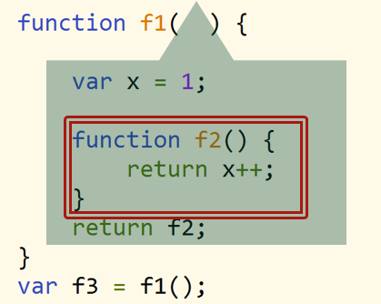

#### （1）   闭包

##### 1.   概念

**函数与对其词法环境的引用**共同构成闭包

闭包是由函数以及创建该函数的词法环境组合而成。这个环境包含了这个闭包创建时**所需**访问的**所有局部**变量（绿色的地方）



##### 2.   闭包的作用

可通过闭包访问函数作用域内的局部变量

**使函数中的变量被保存在内存中不被释放**

##### 3.   闭包的缺点

由于闭包会使得函数中的变量都被保存在内存中，内存消耗大

闭包会在父函数外部，改变父函数内部变量的值

##### 4.   闭包的应用

IIFE——解决变量共享、变量污染问题

```javascript
var tabs = document.getElementsByTagName("li");
var contents = document.getElementById("contents");
for (var i = 0; i < tabs.length; i++) {
    !function(i){
        tabs[i].onclick = function() {
            for (var j = 0; j < tabs.length; j++) {
                tabs[j].className = "";
            }
            this.className = "active";
            contents.innerHTML = "点击了" + i;
        };
    }(i);
}
```

##### 5.   闭包的常用形式

a.   以**普通函数**形式返回

```javascript
var tmp = 100;
function foo(x) {
	var tmp = 3;
	return function(y) {
		console.log(x + y + ++tmp);
	};
}
var fee = foo(2);
fee(10);//16
fee(10);//17
fee(10);//18
```

b.   作为**对象的方法**返回

```javascript
function counter() {
	var n = 0;
	return {
		count: function() {
					return ++n;
				},
		reset: function() {
					n = 0;
					return n;
				}
	};
}
var c = counter();
var d = counter();
console.log(c.count());//1
console.log(d.count());//1
console.log(c.reset());//0
console.log(c.count());//1
console.log(d.count());//2
```

#### （2）   This绑定

##### 1.   概述

this 是被自动定义在所有函数的作用域中一个关键字

this 是在**函数运行期间绑定**，与函数定义无关

##### 2.   This作用

复用代码，为函数自动引用合适的上下文对象

提供了一个更加优雅而简便的方式来隐式传递一个对象引用

##### 3.   This绑定规则

根据函数调用形式分为4种

绑定优先级：**new 绑定 > 显式绑定 > 隐式绑定 > 默认绑定**

a.   作为函数直接调用（定时器函数、立即执行函数等）——默认绑定Window

函数嵌套时，需注意 this 不进行作用域传递

解决：变量 _this、that、self锁定this，bind() 锁定

```javascript
btn.onclick = function () {
	var a = 300;
	var _this = this;//注意
	function show() {
		var a = 200;
		console.log(_this.a);
		console.log(_this.id);
	}
	setTimeout(show, 3000);
}
btn.onclick = function () {
	var a = 300;
	function show() {
		var a = 200;
		console.log(this.a);
		console.log(this.id);
	}
	setTimeout(show.blind(this), 3000);//注意
}
```

b.   作为对象方法调用——隐式绑定

函数作为对象的方法调用时，函数上下文指向这个对象

数组中存放函数，被数组索引调用，this上下文指向这个数组

```javascript
function fun() {
	console.log(this.length);
}
var length = 10;
var arr = [100, 200, fun];
fun(); //10
arr[2](); //3
```

c.   作为构造函数——new绑定

d.   通过call/apply调用——显示绑定

#### （3）   严格模式

##### 1.   概述

严格模式是采用具有限制性 JavaScript 变体的一种方式

严格模式可以应用到整个脚本或个别函数中

##### 2.   开启严格模式

整个脚本文件开启严格模式，需要在所有语句之前放一个特定语句 **"use strict";**

某个函数开启严格模式，得把 **"use strict";** 声明放在函数体所有语句之前

##### 3.   严格模式对 JavaScript 的语法和行为，都做了一些改变

a.   普通模式中，如果一个变量没有声明就赋值，默认是全局变量

**严格模式下，禁止这种用法，变量必须先声明再使用**

b.   普通模式中，在全局作用域函数中的 this 指向 window 对象

**严格模式下，全局作用域中函数中的 this 是 undefined**

c.   普通模式中，构造函数不加 new 也可以调用，this 指向全局对象

**严格模式下，构造函数不加 new 调用，this 报错**

d.   普通模式中，函数允许参数重名

**严格模式下，函数参数不允许重名**

#### （4）   函数形式

##### 1.   纯函数

一个函数的输出不受外部环境影响，同时也不影响外部环境时，只关注逻辑运算和数学运算，同一个输入总得到同一个输出

相同的输入得到相同的输出

不会产生副作用

```javascript
//纯函数
var arr = [1, 2, 3, 4, 5, 6, 7];
function getLast(arr) {
	return arr[arr.length - 1];
}
//非纯函数
function getLast(arr) {
	return arr.pop();
}
```

##### 2.   高阶函数

对其他函数进行操作的函数

函数的参数为函数，函数的返回值为函数

在封装一个函数时，对于一个**不确定的变量**，我们使用传递参数的方式来指定

在封装一个函数时，对于一个**不确定的过程**，我们向函数中传入另一个函数来指定

##### 3.   回调函数

一个函数被作为参数传递给另一个函数（在这里我们把另一个函数叫做“otherFunction”），回调函数在 otherFunction 中被调用

回调函数并不会马上被执行。它会在包含它的函数内的某个特定时间点被“回调”（比如定时器）