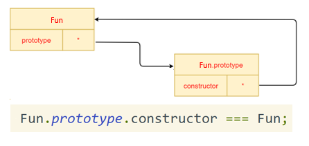
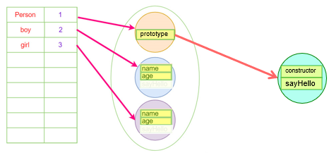
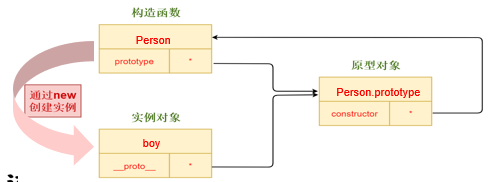
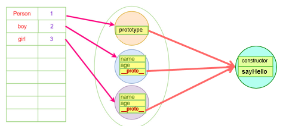
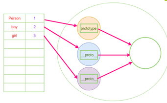

#### （1）   构造函数三要素

##### 1.   构造函数定义与调用

构造函数的**首字母必须大写**，用来区分于普通函数

内部使用的 this 对象，来指向即将要生成的实例对象

使用 new 运算符调用

##### 2.   实例化与内存

实例化即创建一个实例对象，分配内存

执行构造函数即对分配的内存空间进行初始化

```javascript
function Person(name, age) {
	this.name = name;
	this.age = age;
	this.sayHello = function () {
		console.log(this.name + "say hello");
	}
}
var boy = new Person("bella", 23);
var girl = new Person("Lucy", 20);
boy.sayHello === girl.sayHello;//false
```

这样会造成**内存浪费**，函数都输一样的，但是实例化一个对象就会开辟一个新的函数的空间

##### 3.   返回值

**没有return**语句，返回this，即实例对象

**有return**语句，且返回值为**基本数据类型**，构造函数会忽略return的值，依然返回 this 对象

**有return**语句，且返回值为**引用数据类型**，构造函数会返回return的值

#### （2）   Prototype/__proto__

**Fun.prototype === fun.__proto__**

**Fun.prototype.constructor === Fun**

##### 1.   prototype 属性

使用者：**只有函数才会有 prototype 属性**

创建者：只要创建一个函数 fun，JavaScript 引擎会根据一组特定的规则为该函数创建一个对象，并初始化有一个属性 constructor，用来引用该函数。

作用：我们可以通过 prototype 属性使向对象添加属性和方法





##### 2.   __proto__ 属性

**每个实例对象（object）都有一个属性__proto__**指向它的构造函数的原型对象（prototype）

实例对象可以访问这个原型对象中的属性，就像本身拥有该属性一样



```javascript
function Person(name, age) {
	this.name = name;
	this.age = age;
}
Person.prototype.sayHello = function() {
	console.log(this.name + "say hello");
};
```



##### 3. 原型对象

可以看做**公共容器**，把重复的东西放到公共容器

定义在原型对象上的属性会让它的所有实例对象都共享这个属性，但是不会在每个实例的内部重新定义这个方法，内存占用就比较小



#### （3）   静态/实例/原型属性

实例对象可以访问本身对象上的实例属性，也可以访问原型对象上的原型属性，但是**不能访问构造函数上的静态属性**。静态属性只能通过构造函数来访问

```javascript
function People(name) {
	this.name = name;
}
People.index = 1; //静态属性
People.prototype.hobby = "singing"; //原型属性
var per = new People("Tom");
per.age = 20; //实例属性
```

#### （4）   New运算符

##### 1.   New运算符的作用

创建一个空的简单 JavaScript 对象（即 {}）

该对象会被执行 [[ prototype ]] 连接

将该对象作为 this 的上下文，并执行构造函数中的代码

如果构造函数没有返回**引用类型**，则返回 this 指向的实例对象

##### 2.   New功能封装

```javascript
function New(func) {
    // 声明一个中间对象，该对象为最终返回的实例
    var res = {};
    // 将实例的原型指向构造函数的原型
    res.__proto__ = func.prototype;
    // ret为构造函数执行的结果，这里通过apply
    //将构造函数内部的 this 指向修改为指向 res，即为实例对象
    var ret = func.apply(res,Array.prototype.slice.call(arguments, 1));
    // 当我们在构造函数中明确指定了返回对象时，那么new的执行结果就是该返回对象
    if ((typeof ret === "object" || typeof ret === "function") && !== null) {
    return ret;
    }
    // 如果没有明确指定返回对象，则默认返回res，这个res就是实例对象
    return res;
}
```